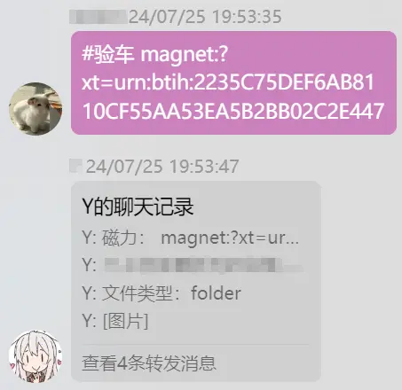
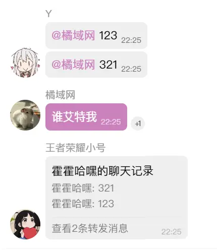
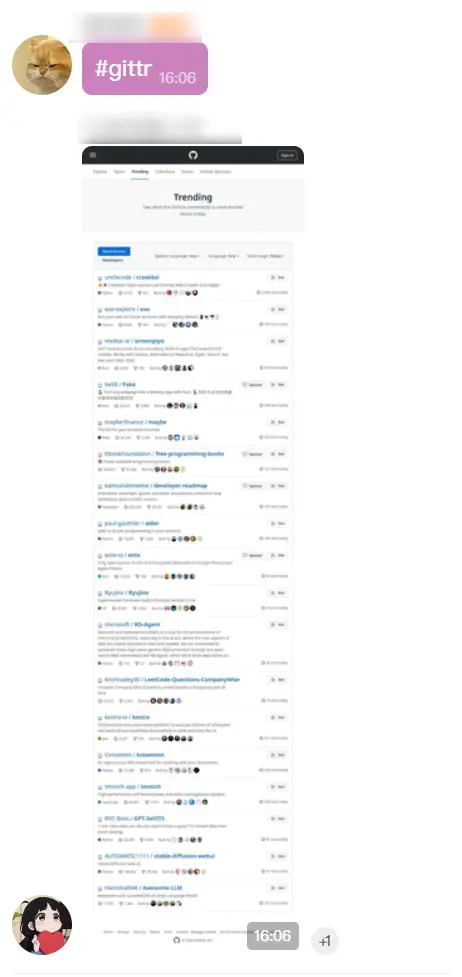
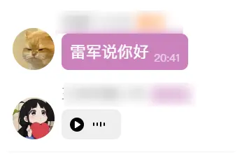
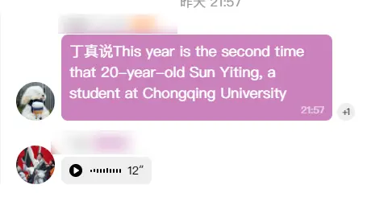
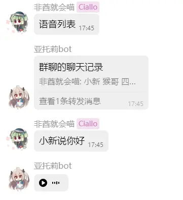

# R 插件轻量级补集

## 状态

- ✅ kimi.js 
- ✅ kimi2.js 
- ✅ check-car.js （由[Mix](https://github.com/MiX1024)提供）
- ✅ 谁艾特我
- ✅ 链接截图
- ✅ 使用http解决ncqq点赞插件
- ✅ 一些语音包
- ✅ GPT-SoVITS 接口适配
- ✅ NCQQ 3.4.6 以上快捷语音包

## kimi.js 使用指南

1. 下载 / 更新 `kimi.js`
```shell
curl -fsSL https://gitee.com/kyrzy0416/rconsole-plugin-complementary-set/raw/master/kimi.js > plugins/rconsole-plugin/apps/kimi.js
```

2. 准备环境
如果没有安装 `Docker` 以及组件的话可以按照[文档](https://gitee.com/kyrzy0416/rconsole-plugin#%E5%BE%AE%E4%BF%A1%E6%96%87%E7%AB%A0%E6%80%BB%E7%BB%93-%E5%AE%8C%E5%85%A8%E5%85%8D%E8%B4%B9%E6%80%BB%E7%BB%93)进行安装，需要补充以下内容到`R插件`：
```yaml
aiBaseURL: '' # 用于识图的接口，kimi默认接口为：https://api.moonshot.cn，其他服务商自己填写
aiApiKey: '' # 用于识图的api key，kimi接口申请：https://platform.moonshot.cn/console/api-keys
aiModel: 'moonshot-v1-8k' # 模型，使用kimi不用填写，其他要填写
```

3. 直接使用，触发关键字（`#kimi`）即可


## kimi2.js -- 图文版本

1. 下载 / 更新

```shell
curl -fsSL https://gitee.com/kyrzy0416/rconsole-plugin-complementary-set/raw/master/kimi2.js > plugins/rconsole-plugin/apps/kimi.js
```

2. 填写信息 && 安装依赖

```yaml
aiBaseURL: '' # 用于识图的接口，kimi默认接口为：https://api.moonshot.cn，其他服务商自己填写
aiApiKey: '' # 用于识图的api key，kimi接口申请：https://platform.moonshot.cn/console/api-keys
aiModel: 'moonshot-v1-8k' # 模型，使用kimi不用填写，其他要填写
```

```shell
pnpm add marked --filter=rconsole-plugin
```

3. 直接使用，触发关键字（`#kimi`）即可


## 验车（由[Mix](https://github.com/MiX1024)提供）

1. 下载 / 更新 `check-car.js`
```shell
curl -fsSL https://gitee.com/kyrzy0416/rconsole-plugin-complementary-set/raw/master/check-car.js > plugins/rconsole-plugin/apps/check-car.js
```

2. 到`https://whatslink.info/` 随便解析一个磁力，然后获取cookie:

3. 修改 `46` 行的 cookie：
```javascript
'Cookie': 'aliyungf_tc=xxx',
```

4. 使用示例：



## 谁艾特我

群里有时候要处理群友提出的 bug 就会找At 之前这个脚本没有进行排序, 要拉到最底下, 现在做了排序第一个就是最新的

```shell
curl -fsSL https://gitee.com/kyrzy0416/rconsole-plugin-complementary-set/raw/master/who-at-me.js > plugins/rconsole-plugin/apps/who-at-me.js
```



## 链接截图（群内小伙伴提的需求，说某插件的截图不好用）

- 随便发http开头就会截图
- #gittr 查看每日GitHub热榜

放到example即可

```shell
curl -fsSL https://gitee.com/kyrzy0416/rconsole-plugin-complementary-set/raw/master/screenshot.js > plugins/example/screenshot.js
```



## 使用http解决ncqq点赞插件

```shell
curl -fsSL https://gitee.com/kyrzy0416/rconsole-plugin-complementary-set/raw/master/thumbs-up.js > plugins/rconsole-plugin/apps/thumbs-up.js
```

## 语音包

1. 安装
```shell
curl -fsSL https://ghproxy.net/https://raw.githubusercontent.com/zhiyu1998/rconsole-plugin-complementary-set/main/deep-faker.js > plugins/example/deep-faker.js
```

2. 安装依赖
```shell
pnpm add form-data axios -w
```

3. 开始游玩



## GPT-SoVITS 接口适配

适配 [GPT-SoVITS-WebUI](https://github.com/RVC-Boss/GPT-SoVITS) 语音的小型插件

- 搭建 [GPT-SoVITS-WebUI](https://github.com/RVC-Boss/GPT-SoVITS)
- 搭建 [GPT-SoVITS 的api调用接口](https://github.com/jianchang512/gptsovits-api)

克隆到 `example`
```shell
curl -fsSL https://ghproxy.net/https://raw.githubusercontent.com/zhiyu1998/rconsole-plugin-complementary-set/main/gpt-sovits.js > plugins/example/gpt-sovits.js
```

1. 修改地址
```shell
const GPTSOVITS_HOST = "http://localhost:9880"
```

2. 修改人物，比如`丁真`
```shell
const voiceList = Object.freeze([
    "丁真",
])
```

3. 开始游玩


## NCQQ 3.4.6 以上快捷语音包

> ⚠️ 必须是 NCQQ 3.4.6 及以上才可以使用

克隆到 `example`
```shell
curl -fsSL https://ghproxy.net/https://raw.githubusercontent.com/zhiyu1998/rconsole-plugin-complementary-set/main/ncqq-ai-voice.js > plugins/example/ncqq-ai-voice.js
```


